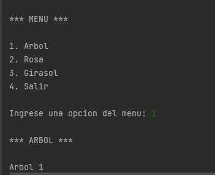
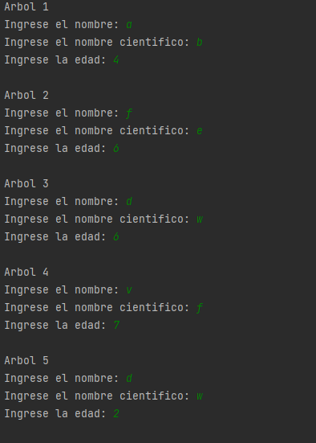
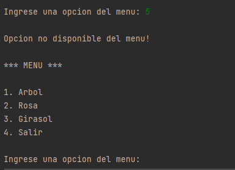
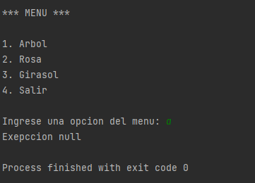

El programa consiste en la creacion de una herencia multinivel de 4 niveles de la clase plantas
, una vez creadas las clases respectivas se procede a guardar los valores solicitados dentro de un arreglo
y por ultimo la impresion de estos datos

